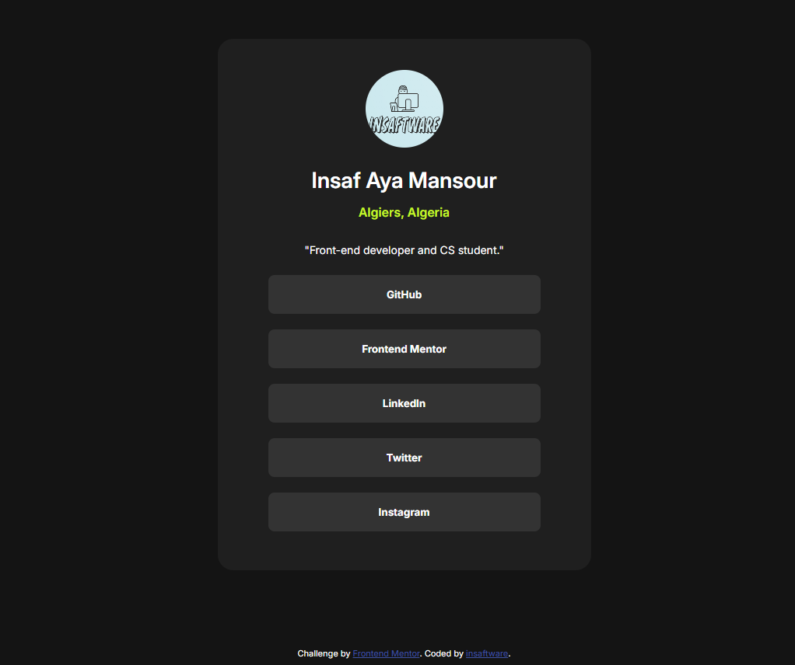

This is a solution to the [Social links profile challenge on Frontend Mentor](https://www.frontendmentor.io/challenges/social-links-profile-UG32l9m6dQ). Frontend Mentor challenges help you improve your coding skills by building realistic projects. 

1-The challenge
  Users should be able to:
  - See hover and focus states for all interactive elements on the page

2-Screenshot
  

3-My process
  built that in one day - around 4 hours

4-Built with
  - Semantic HTML5 markup
  - CSS custom properties
  - Flexbox